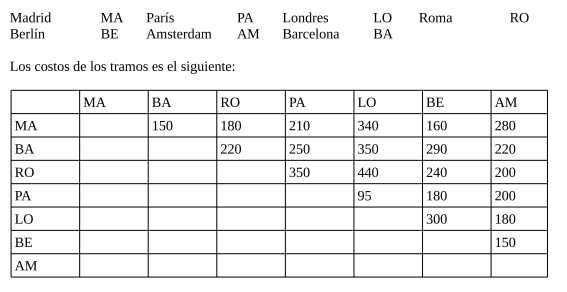

# ExamenFinalAED
Proyecto final de Algoritmos y Estructuras 
de Datos.

---

### Enunciado
Los alumnos que promocionan Algoritmos y Estructuras de Datos están planeando realizar un viaje a Europa para festejar la promoción. El plan es llegar a Madrid desde Argentina y hacer un recorrido de ciudades de Europa que retorne a Madrid. Como tiene un presupuesto limitado, deben analizar varias opciones para tomar una decisión de como hacer el recorrido.

El costo de los tramos entre ciudades es simétrico, es decir el coste para ir de la ciudad A a la B es el mismo que para ir desde la ciudad B a la A.

Filas es origen y columnas destino. El problema se llama camino o ciclo “Hamiltoniano” dependiendo si se regresa o no al punto de partida. Ud deberá computar un ciclo Hamiltoniano que empiece y termine en Madrid. Como Aerolineas Argentinas tiene vuelo directo a Buenos Aires desde Barcelona y Roma, esta la opción de no volver a Madrid para regresar a Argentina y terminar el viaje en Barcelona o Roma y desde allí regresar (hacer un camino Hamiltoniano).

Ud. debe determinar el mejor opción para el viaje, es decir, el de costo mínimo tanto el de ciclo como el de los caminos Hamiltonianos que terminen en BA o RO. Para ello deberá implementar dos versiones de código que determine el óptimo.

1) El camino más económico aplicando un algoritmo de búsqueda en profundidad. En este algoritmo deberá utilizar una pila de datos.

2) Dada una posible restricción económica con la cual los estudiantes solo puedan contar con un máximo de 700, calcule el camino y ciclo hamiltoniano más largo posible qu sea posible con ese presupuesto, en términos de cantidad de ciudades visitadas. Utilice la búsqueda en profundidad del punto anterior con podas de ramificaciones.

3) El camino Hamiltoniano más barato aplicando el algoritmo de Kaufmann y Malgrange, que utiliza la multiplicación latina de matrices utilizando mapas de bits para las operaciones.